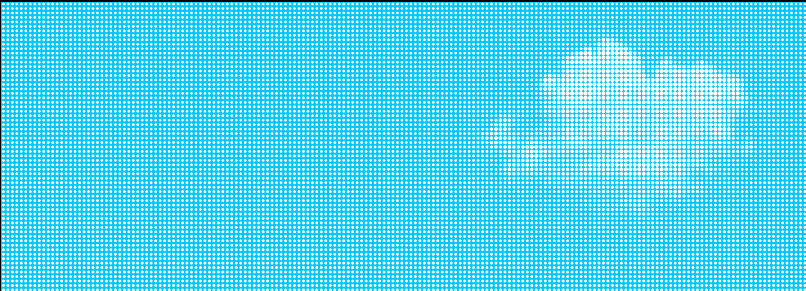
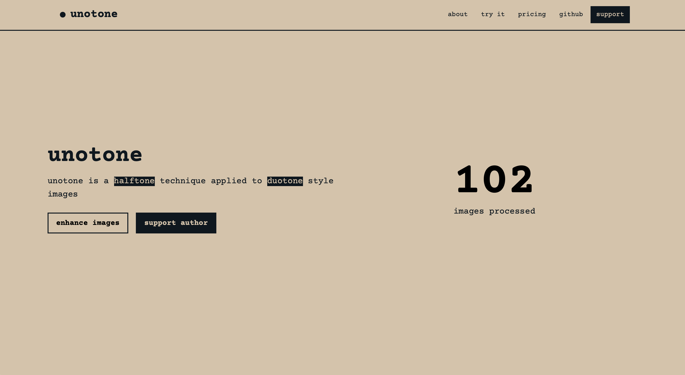

# unotone

  

&ensp;[<kbd>   Overview   </kbd>](#overview)&ensp;
&ensp;[<kbd>   Preview   </kbd>](#preview)&ensp;
&ensp;[<kbd>   Examples   </kbd>](#examples)&ensp;
&ensp;[<kbd>   Deploy   </kbd>](#deploy)&ensp;
    

## Overview

What's 'unotone'? It's pretty simple. It's a [halftone technique](https://en.wikipedia.org/wiki/Halftone) applied to [duotone effect](https://www.geeksforgeeks.org/what-is-duotone-effect) images.

So basically, it's $\frac{1}{2}$ tone $\times$ 2 tone $= 1$ (uno) tone

## Preview
Latest release preview is deployed here: [containers.yandexcloud.net](https://bbafs7lle6kr3q72mjfa.containers.yandexcloud.net)

## Examples
WIP

## Deploy
WIP

## License
[MIT](https://choosealicense.com/licenses/mit/)
